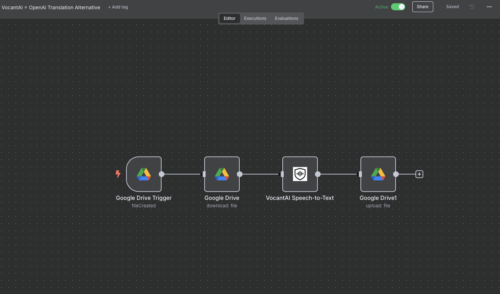

# VocantAI Speech-to-Text Translation Workflow for n8n

## Overview

This workflow integrates [VocantAI](https://vocant.ai), a privacy and security-focused speech-to-text translation service, with n8n. VocantAI ensures your audio data is processed securely, making it ideal for sensitive or confidential use cases.

**Key Features:**

- **Privacy & Security:** Your data is protected throughout the transcription and translation process - great for Legal, Healthcare and other privacy focused services/industries for translation.
- **Performance:** VocantAI delivers faster than many alternatives.
- **Easy Integration:** Uses n8n’s Google Drive nodes to trigger, download, and store transcriptions.
- **Usage Dashboard:** VocantAI provided great usage and management dashboards for tracking.
- **Free Trial:** Get 30 days of professional access with the coupon code below!

## How It Works

1. **Trigger:** Watches a specific Google Drive folder for new audio files.
2. **Download:** Automatically downloads new files.
3. **Transcribe & Translate:** Sends audio to VocantAI for speech-to-text and translation.
4. **Save Results:** Uploads the transcribed text back to Google Drive.

## Getting Started

1. **Import the Workflow:**  
   Download the workflow JSON from [GitHub](https://github.com/PriaAI/n8n_share/VocantAI-STT-Translation/) and import it into your n8n instance.

2. **Set Up Credentials:**

   - Google Drive OAuth2 API (for file access)
   - VocantAI Account for API Key (for transcription)

3. **Configure Folders:**

   - Set the folder IDs for your source and destination in the workflow parameters.

4. **Start the Workflow:**  
   Activate the workflow to begin automatic transcription and translation.

## 30 Day FREE Professional Coupon

**Try VocantAI Professional FREE for 30 days!**  
Use coupon code (while it last):

```
30DAYPROMO1
```

at [https://vocant.ai](https://vocant.ai) when signing up.

## Support & Feedback

- For questions or feedback, join the [n8n reddit community](https://www.reddit.com/r/n8n_TechSolutions/) or contact [VocantAI support](https://vocant.ai/contact).
- Share your experience and improvements—especially if you find ways to further boost performance!
